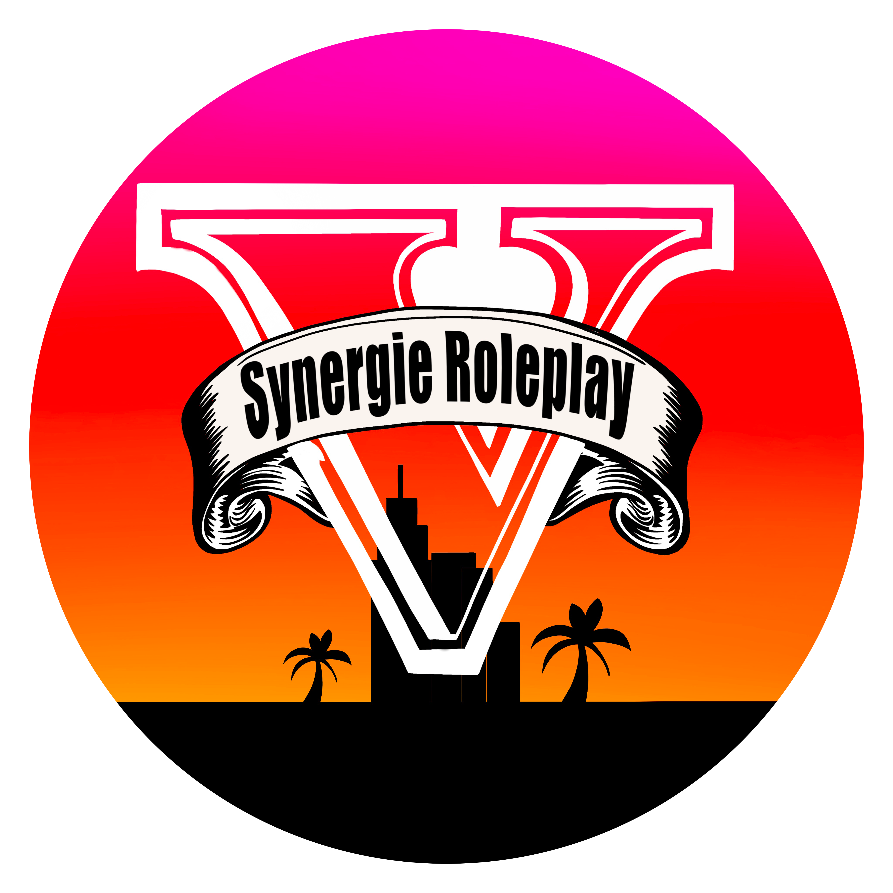

# Synergie Roleplay

<p align="center">
  
</p>

Synergie Roleplay est un serveur Roleplay français sur GTA V (FiveM) utilisant le [Framework **ESX**](https://forum.cfx.re/t/release-esx-base/39881).

Ce serveur est désormais fermé par manque de joueurs et de motivation mais je laisse mes scripts modifiés à disposition.

# Fonctionnalités proposées

- Double Job
- Métiers Pôle-Emploi (Intérim) & WhiteList (CDI)
- Gangs / Organisations & Drogues
- Système de prison réaliste (Cellules, Parloir, Travail pour les prisonniers, ...)
- Système de modération (Logs des actions, bannissement, spectate, ...)

## Lancement du serveur

```shell
cd server-data && ./runserver.sh
```

Il faut également configurer le reboot automatique du serveur à l'aide du fichier **reload_fxserver.sh** qui s'occupe d'éteindre le serveur,
vider son cache et le redémarrer

## Autres ressources

Le logo du serveur à été réalisé par **Kscie#4875** (Discord)

D'autres documents ont été réalisés pour le serveur dont voici les liens :
- [Règlement](https://drive.google.com/file/d/1F0_8oeZ93r6K6NZsMjFmYhbKfLDOu2St/view?usp=sharing)
- [Formulaire de création de Gang](https://drive.google.com/file/d/1d4OIor70Z6XlqtArp13lcAOARP3KePJ2/view?usp=sharing) & [Formulaire de mort RP](https://drive.google.com/file/d/1T8wi9TK8rDSrrxJFGahvIWNyuZDT4Ez0/view?usp=sharing)
- [Liste des Infractions](https://docs.google.com/spreadsheets/d/1LDVsO_F3Gaua52ESS1WEy8IArkyAQvj6EMlBJLKIRbY/edit?usp=sharing)

## Membres du Staff


| Pseudo          | Nom RP          | Rôle           |
| --------------- | --------------- | -------------- |
| Drmarsupial35   | Charlie Brown   | Fondateur      |
| Rtoko           | Thomas Tijuana  | Administrateur |
| Lasbinouze      | Léo Constantine | Administrateur |
| Tyrex           | Jeremy Lachinov | Modérateur     |
| Mathys          | Jeremy Boulogne | Modérateur     |
| LPG             | Martin Tintet   | Helpeur        |
| Kscie           |                 | Graphiste      |
