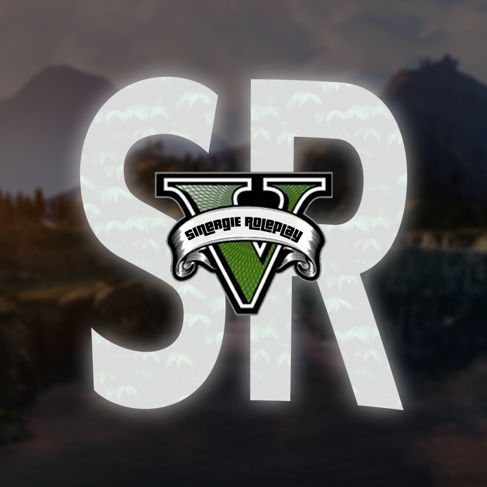

# Synergie-Roleplay

<p align="center">
  
</p>


Dépot contenant les différents dossier du serveur Synergie Roleplay (Serveur GTA V Roleplay). Il utilise le [Framework **ESX**](https://forum.cfx.re/t/release-esx-base/39881).

Le bot Discord est codé en **Python** et permet d'effectuer différentes commandes :
- Système de tickets
- Affectation automatique de rôles
- Création de messages **Embed**
- Ouverture et Fermeture de salons
- Ajout de réations sur des messages

## Lancement

```shell
cd FiveM/server-data && ./runserver.sh
```

## Liens divers

*Invitation Discord :* **https://discordapp.com/invite/SqAE8Jg**

*Lien Top Serveur :* **https://top-serveurs.net/gta/synergie-roleplay**

*Adresse IP:* **185.44.81.48**
